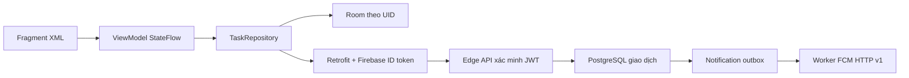
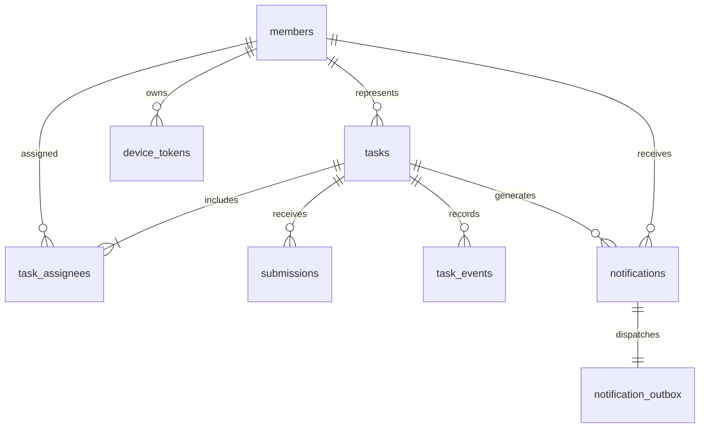

# API và luồng dữ liệu
Base URL: `https://PROJECT.supabase.co/functions/v1/api/v1/`.
Header: `Authorization: Bearer FIREBASE_ID_TOKEN`.
Tất cả mutation có `requestId` UUID; thao tác công việc hiện có thêm `expectedVersion`.
Cùng UID/requestId/method/path/body trả lại kết quả cũ. Đổi nội dung dưới cùng requestId trả 409.
JSON camelCase, timestamp ISO 8601 UTC. Server là nguồn quyết định quyền và trạng thái.

| Method | Path | Body chính |
|---|---|---|
| GET/PATCH | me | displayName, avatarUrl khi PATCH |
| GET | members | |
| PATCH | members/{uid} | active |
| GET/POST/DELETE | invites | email khi POST/DELETE |
| GET/POST | tasks | title, description, dueAt, priority, assigneeIds, representativeId khi POST |
| GET/PATCH | tasks/{id} | các trường công việc khi PATCH |
| POST | tasks/{id}/start | expectedVersion |
| POST | tasks/{id}/submissions | expectedVersion, description, link |
| POST | tasks/{id}/review | expectedVersion, submissionId, approve, reason |
| POST | tasks/{id}/reopen | expectedVersion, reason |
| POST | tasks/{id}/archive | expectedVersion |
| GET | tasks/{id}/history | |
| GET | notifications | |
| PATCH | notifications/{id} | đánh dấu đã đọc |
| PUT/DELETE | devices/{installationId} | token khi PUT |

Status: TODO → IN_PROGRESS → IN_REVIEW → DONE. Trả lại hoặc mở lại về IN_PROGRESS.
Priority: LOW, NORMAL, HIGH.
Task response: id, title, description, dueAt, priority, status, representativeId, assigneeIds, createdBy, version, archivedAt, currentSubmissionId.
History response có events và submissions; mỗi lần nộp được giữ riêng.
Member: uid, displayName, avatarUrl, role, active; email chỉ trả cho bản thân và nhóm trưởng.
Notice: id, taskId, kind, read, createdAt.

| HTTP | code | UI |
|---|---|---|
| 401 | UNAUTHORIZED | làm mới Firebase token một lần, sau đó yêu cầu đăng nhập |
| 403 | UNVERIFIED / NOT_INVITED / FORBIDDEN | xác minh email / xin quyền / thao tác bị từ chối |
| 404 | NOT_FOUND | dữ liệu không còn tồn tại |
| 409 | CONFLICT / INVALID_STATE / ASSIGNED_WORK | tải lại, giữ nội dung soạn hoặc phân công lại |
| 422 | VALIDATION | kiểm tra đầu vào |
| 429 | RATE_LIMIT | thử lại sau một phút |
| 413 | PAYLOAD_TOO_LARGE | giảm nội dung request |
| 500 | SERVER_ERROR | báo lỗi chung, không lộ SQL hoặc secrets |

Giới hạn mutation: 60/phút/tài khoản; request tối đa 32 KiB. Deadline cần hợp lệ; việc quá hạn vẫn được giữ để xử lý.
Một nhóm nhỏ: mutation được serialize bằng advisory transaction lock. Khi phục vụ nhiều nhóm/ghi lớn, chuyển sang khóa theo nhóm/công việc.
Room cache được phân vùng bởi Firebase UID; UI quan sát Room qua StateFlow. Mạng không ghi trực tiếp vào view.
Bản nháp gồm owner, taskId, description, link, requestId và expectedVersion; lỗi mạng giữ nguyên mã để replay an toàn.

## Kiến trúc và dữ liệu





`invites` cho phép email xác minh gia nhập; `api_requests` lưu kết quả idempotency theo UID; `api_limits` đếm mutation theo phút. Room lưu cache JSON theo owner/kind/id và bảng drafts riêng. Không coi cache là nguồn cấp quyền server.

## Ma trận quyền

| Thao tác | Thành viên hoạt động | Đại diện của việc | Nhóm trưởng |
|---|---|---|---|
| Xem việc, lịch sử, danh sách thành viên | Có | Có | Có |
| Sửa hồ sơ | Bản thân | Bản thân | Bản thân |
| Đọc/đánh dấu thông báo, quản lý thiết bị | Bản thân | Bản thân | Bản thân |
| Bắt đầu/nộp | Không | Có, đúng trạng thái | Chỉ khi là đại diện |
| Tạo/sửa/phân công/lưu trữ | Không | Không | Có |
| Duyệt/trả lại/mở lại | Không | Không | Có |
| Lời mời/ngừng quyền | Không | Không | Có, không ngừng người đang giữ việc chưa xong |

Mọi route yêu cầu email xác minh và thành viên hoạt động, ngoại trừ GET me có thể tạo thành viên từ lời mời hợp lệ. Tài khoản không được mời không đọc được dữ liệu nhóm.

## Ví dụ nộp và duyệt

`POST tasks/{id}/submissions`:
```json
{"requestId":"7d1cda9c-d14b-43b8-9607-918939f5ceba","expectedVersion":2,"description":"Đã kiểm thử bản dựng","link":"https://example.com/result"}
```
Phản hồi là Task mới; dùng `version` và `currentSubmissionId` từ phản hồi khi nhóm trưởng gọi `POST tasks/{id}/review`:
```json
{"requestId":"a70d7581-c3b1-4e55-a6c8-0f490e978ef1","expectedVersion":3,"submissionId":"UUID_CUA_BAN_NOP","approve":false,"reason":"Bổ sung bằng chứng kiểm thử"}
```
Nếu timeout, gửi lại nguyên body và requestId. Nếu 409, tải bản mới và cho người dùng đối chiếu; không tự nâng expectedVersion của nội dung cũ.
